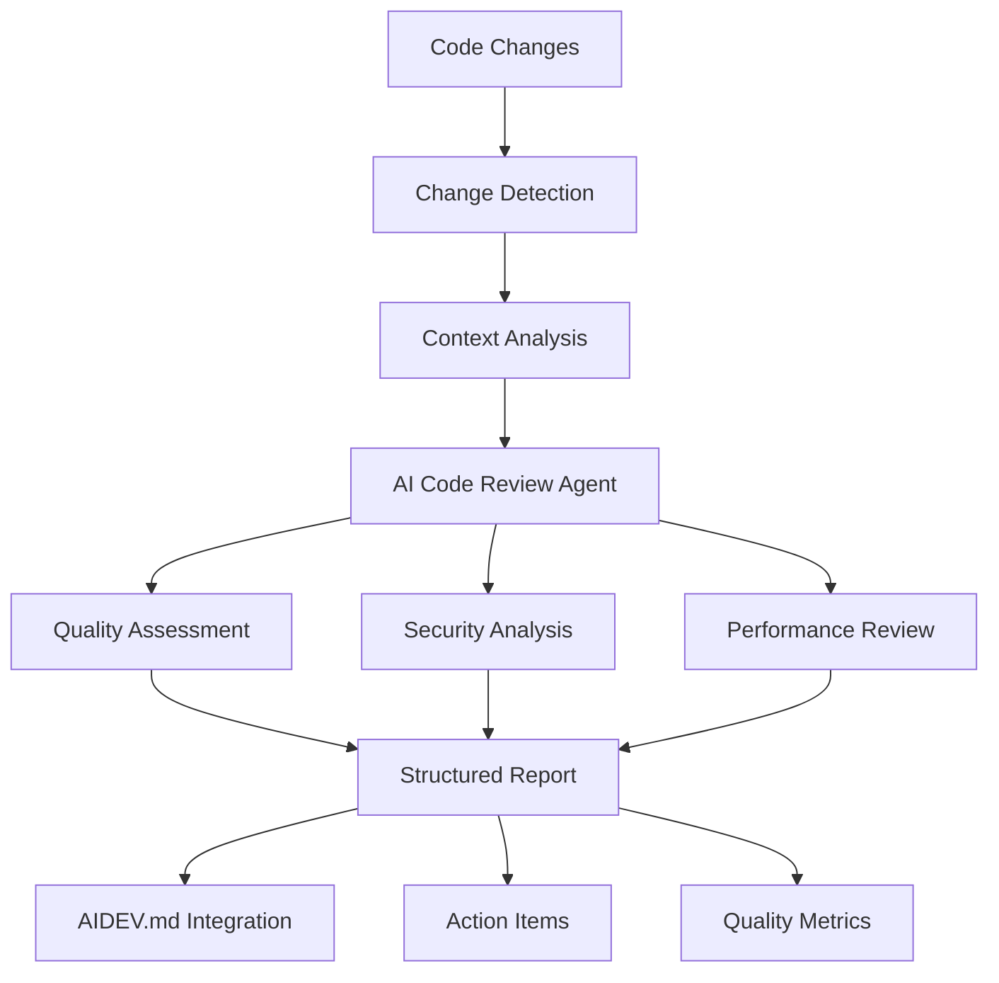

# AI-Powered Code Review Guide: Intelligent Code Analysis and Quality Assurance

This guide provides comprehensive instructions for using the **AI-Powered Code Review Agent** - an intelligent code analysis system that provides thorough, automated code reviews while maintaining the highest standards of quality, security, and maintainability.

## Overview

The AI-Powered Code Review Agent represents a significant advancement in the AI Dev Playbook's autonomous development capabilities. It provides comprehensive, intelligent code analysis that goes beyond traditional static analysis tools to deliver contextual, actionable feedback on code changes.

### Key Capabilities

- **Comprehensive Analysis**: Multi-dimensional code review covering quality, security, performance, and maintainability
- **Context-Aware Reviews**: Understanding of business logic, domain requirements, and architectural patterns
- **Security-First Approach**: Proactive identification of vulnerabilities and compliance issues
- **Performance Assessment**: Analysis of performance implications and optimization opportunities
- **Integration-Ready**: Seamless integration with Git workflows, CI/CD pipelines, and development processes
- **Knowledge Synthesis**: Automated generation of review summaries for AIDEV.md integration

## Architecture Overview

### Review Process Flow



### Analysis Dimensions

#### **Code Quality Assessment**
- Cyclomatic complexity analysis
- Code duplication detection
- Naming convention compliance
- SOLID principles adherence
- Design pattern appropriateness
- Maintainability metrics

#### **Security Analysis**
- Vulnerability scanning (OWASP Top 10)
- Input validation and sanitization
- Authentication and authorization checks
- Data encryption and protection
- Compliance validation (GDPR, HIPAA, etc.)
- Threat modeling and risk assessment

#### **Performance Analysis**
- Algorithmic complexity evaluation
- Database query optimization
- Memory usage patterns
- Network communication efficiency
- Scalability assessment
- Resource utilization analysis

#### **Testing and Documentation**
- Test coverage assessment
- Test quality evaluation
- Documentation completeness
- API documentation accuracy
- Code comment quality

## Getting Started

### Prerequisites

1. **AI Dev Playbook Setup**: Complete AI Dev Playbook installation
2. **Git Repository**: Active Git repository with commit history
3. **AI Development Environment**: Access to AI models for code analysis
4. **Secure Environment**: Sandbox capabilities for safe code analysis

### Installation and Setup

#### Step 1: Verify Code Review Agent

Ensure the AI-Powered Code Review Agent is available:

```bash
# Check if the agent prompt exists
ls -la ai-dev/prompts/09-code-review-agent.md

# Verify automation script
ls -la ai-dev/scripts/code-review-automation.sh
```

#### Step 2: Initialize Review Environment

```bash
# Check automation script functionality
./ai-dev/scripts/code-review-automation.sh help

# View current status
./ai-dev/scripts/code-review-automation.sh status
```

#### Step 3: Setup Git Hooks (Optional)

For automated review integration:

```bash
# Install Git hooks for automatic review triggers
./ai-dev/scripts/code-review-automation.sh setup-hooks
```

This installs:
- **Pre-commit hook**: Generates review context for staged changes
- **Post-commit hook**: Creates review context for committed changes

## Usage Patterns

### 1. Pre-Commit Review

Review staged changes before committing:

```bash
# Stage your changes
git add .

# Generate review context for staged changes
./ai-dev/scripts/code-review-automation.sh review staged pre-commit
```

**Use Cases:**
- Quality validation before commit
- Security check for sensitive changes
- Compliance verification
- Best practices enforcement

### 2. Commit Review

Review a specific commit after it's been made:

```bash
# Review the latest commit
./ai-dev/scripts/code-review-automation.sh review HEAD commit

# Review a specific commit
./ai-dev/scripts/code-review-automation.sh review abc1234 commit
```

**Use Cases:**
- Post-commit quality assessment
- Security audit of recent changes
- Performance impact analysis
- Documentation validation

### 3. Pull Request Review

Comprehensive review of a feature branch or PR:

```bash
# Review changes from main to feature branch
./ai-dev/scripts/code-review-automation.sh review main..feature-branch pull-request

# Review last 5 commits as a cohesive change
./ai-dev/scripts/code-review-automation.sh review HEAD~5..HEAD pull-request
```

**Use Cases:**
- Feature completeness validation
- Integration impact assessment
- Comprehensive security review
- Architecture compliance checking

### 4. Continuous Integration Review

Integration with CI/CD pipelines:

```yaml
# Example GitHub Actions workflow
name: AI Code Review
on: [pull_request]
jobs:
  ai-review:
    runs-on: ubuntu-latest
    steps:
      - uses: actions/checkout@v2
      - name: Run AI Code Review
        run: |
          ./ai-dev/scripts/code-review-automation.sh review ${{ github.event.pull_request.base.sha }}..${{ github.event.pull_request.head.sha }} pull-request
```

## AI Review Execution

### Step-by-Step Review Process

#### Step 1: Generate Review Context

The automation script creates comprehensive context including:
- **Change Analysis**: Files modified, lines changed, diff statistics
- **Git Information**: Commit messages, author, timestamps
- **Project Context**: Current branch, repository state
- **Review Instructions**: Specific guidance for the AI agent

#### Step 2: Load AI Code Review Agent

1. **Open AI Development Environment** (VS Code with AI extension, Claude, etc.)
2. **Load Agent Prompt**: Use `ai-dev/prompts/09-code-review-agent.md`
3. **Provide Context**: Share the generated review context file
4. **Execute Review**: Let the AI agent perform comprehensive analysis

#### Step 3: Review AI Output

The AI agent generates structured output including:
- **Executive Summary**: High-level assessment and recommendations
- **Detailed Analysis**: Comprehensive findings by category
- **Actionable Recommendations**: Prioritized action items
- **Quality Metrics**: Quantitative assessment scores

#### Step 4: Process Recommendations

1. **Address Critical Issues**: Fix blocking problems immediately
2. **Plan High-Priority Items**: Schedule important improvements
3. **Consider Optimizations**: Evaluate suggested enhancements
4. **Update Documentation**: Implement documentation recommendations

#### Step 5: Update AIDEV.md

Integrate review results into the development log:
- Use the generated AIDEV entry template
- Customize with actual AI review findings
- Document lessons learned and decisions made

## Advanced Usage

### Custom Review Configurations

#### Security-Focused Review

For security-critical changes:

```bash
# Generate context with security emphasis
./ai-dev/scripts/code-review-automation.sh review staged security-review
```

**AI Agent Instructions:**
- Prioritize security vulnerability detection
- Focus on compliance requirements
- Emphasize threat modeling
- Validate security best practices

#### Performance-Focused Review

For performance-critical changes:

```bash
# Generate context with performance emphasis
./ai-dev/scripts/code-review-automation.sh review HEAD~3..HEAD performance-review
```

**AI Agent Instructions:**
- Analyze algorithmic complexity
- Evaluate resource usage patterns
- Assess scalability implications
- Identify optimization opportunities

#### Architecture Review

For architectural changes:

```bash
# Generate context for architecture review
./ai-dev/scripts/code-review-automation.sh review main..architecture-refactor architecture-review
```

**AI Agent Instructions:**
- Evaluate architectural decisions
- Assess design pattern usage
- Validate separation of concerns
- Consider long-term maintainability

### Integration with Development Workflows

#### Code Review Checklist Integration

Create standardized review checklists:

```markdown
## AI Code Review Checklist

### Pre-Review Setup
- [ ] Review context generated
- [ ] AI agent loaded with appropriate prompt
- [ ] Security and compliance requirements identified
- [ ] Performance criteria established

### Review Execution
- [ ] Code quality assessment completed
- [ ] Security analysis performed
- [ ] Performance impact evaluated
- [ ] Testing requirements validated
- [ ] Documentation review conducted

### Post-Review Actions
- [ ] Critical issues addressed
- [ ] High-priority recommendations planned
- [ ] AIDEV.md updated with findings
- [ ] Team notified of significant findings
```

#### Quality Gates Integration

Implement quality gates based on AI review results:

```bash
#!/bin/bash
# Quality gate script example

REVIEW_OUTPUT="$1"
QUALITY_THRESHOLD=7
SECURITY_THRESHOLD=8

# Parse AI review output (implementation would parse actual AI output)
QUALITY_SCORE=$(grep "Code Quality Score" "$REVIEW_OUTPUT" | grep -o '[0-9]\+')
SECURITY_SCORE=$(grep "Security Score" "$REVIEW_OUTPUT" | grep -o '[0-9]\+')

if [[ $QUALITY_SCORE -lt $QUALITY_THRESHOLD ]] || [[ $SECURITY_SCORE -lt $SECURITY_THRESHOLD ]]; then
    echo "❌ Quality gate failed. Review and address issues before proceeding."
    exit 1
else
    echo "✅ Quality gate passed. Changes meet quality standards."
    exit 0
fi
```

## Best Practices

### Review Preparation

#### **Clear Context Provision**
- Provide comprehensive change context
- Include business requirements and constraints
- Specify security and compliance requirements
- Document performance expectations

#### **Appropriate Scope**
- Review logical units of change
- Avoid overly large change sets
- Focus on cohesive functionality
- Consider architectural boundaries

### AI Agent Interaction

#### **Specific Instructions**
- Provide clear review objectives
- Specify areas of concern or focus
- Include relevant coding standards
- Reference architectural guidelines

#### **Context Awareness**
- Share relevant business logic
- Explain domain-specific requirements
- Provide architectural context
- Include performance constraints

### Review Output Processing

#### **Prioritization**
- Address critical security issues immediately
- Plan high-impact quality improvements
- Consider long-term architectural recommendations
- Balance technical debt with feature delivery

#### **Documentation**
- Capture key decisions and rationale
- Document lessons learned
- Update coding standards if needed
- Share insights with the team

## Quality Assurance

### Review Accuracy Validation

#### **False Positive Management**
- Validate AI findings against actual code behavior
- Consider business logic and domain context
- Assess severity and impact accurately
- Provide feedback to improve AI accuracy

#### **Completeness Verification**
- Ensure all critical areas are covered
- Validate security analysis thoroughness
- Confirm performance implications are assessed
- Check documentation review completeness

### Continuous Improvement

#### **Feedback Integration**
- Collect feedback on AI review accuracy
- Track false positive and negative rates
- Monitor review effectiveness metrics
- Adjust review processes based on outcomes

#### **Process Optimization**
- Streamline review workflows
- Automate routine quality checks
- Integrate with development tools
- Enhance team adoption and usage

## Troubleshooting

### Common Issues and Solutions

#### **Issue**: AI review generates too many false positives
**Solution**:
- Provide more specific context and constraints
- Include business logic explanations
- Refine review instructions for domain-specific requirements
- Calibrate severity thresholds appropriately

#### **Issue**: Review process is too slow or cumbersome
**Solution**:
- Optimize review scope and focus areas
- Implement automated pre-filtering
- Streamline context generation
- Integrate with existing development workflows

#### **Issue**: Review recommendations are not actionable
**Solution**:
- Request more specific, step-by-step guidance
- Include examples and code snippets in recommendations
- Prioritize recommendations by impact and effort
- Provide implementation guidance and resources

#### **Issue**: Team adoption is low
**Solution**:
- Provide training and documentation
- Demonstrate value through success stories
- Integrate with existing workflows
- Start with high-value, low-effort use cases

## Success Metrics

### Quantitative Metrics

#### **Quality Metrics**
- **Defect Reduction**: Percentage decrease in post-release defects
- **Code Quality Scores**: Improvement in maintainability metrics
- **Security Vulnerabilities**: Reduction in security issues found in production
- **Performance Issues**: Decrease in performance-related problems

#### **Process Metrics**
- **Review Coverage**: Percentage of changes reviewed by AI
- **Review Turnaround**: Time from change to review completion
- **Action Item Resolution**: Percentage of recommendations implemented
- **False Positive Rate**: Accuracy of AI review findings

### Qualitative Metrics

#### **Developer Experience**
- **Feedback Quality**: Usefulness and actionability of review comments
- **Learning Value**: Knowledge gained through review process
- **Workflow Integration**: Seamlessness of review integration
- **Team Satisfaction**: Developer satisfaction with review process

#### **Code Quality Impact**
- **Maintainability**: Improvement in code maintainability
- **Security Posture**: Enhancement of overall security
- **Performance**: Optimization of application performance
- **Documentation**: Improvement in code documentation quality

## Future Enhancements

The AI-Powered Code Review system provides the foundation for:

### **Advanced AI Capabilities**
- **Machine Learning Integration**: Learn from review patterns and outcomes
- **Predictive Analysis**: Predict potential issues before they occur
- **Personalized Reviews**: Adapt review style to team and project needs
- **Cross-Project Learning**: Share insights across multiple projects

### **Enhanced Automation**
- **Automated Fix Suggestions**: Generate code fixes for common issues
- **Intelligent Prioritization**: Smart ranking of review findings
- **Contextual Documentation**: Automatic generation of code documentation
- **Compliance Automation**: Automated compliance checking and reporting

### **Team Collaboration Features**
- **Review Assignment**: Intelligent assignment of human reviewers
- **Knowledge Sharing**: Capture and share review insights
- **Mentoring Support**: Educational feedback for skill development
- **Team Analytics**: Track team code quality trends and improvements

This AI-Powered Code Review guide provides a comprehensive framework for implementing intelligent, automated code review processes that enhance code quality, security, and maintainability while seamlessly integrating with existing development workflows.
