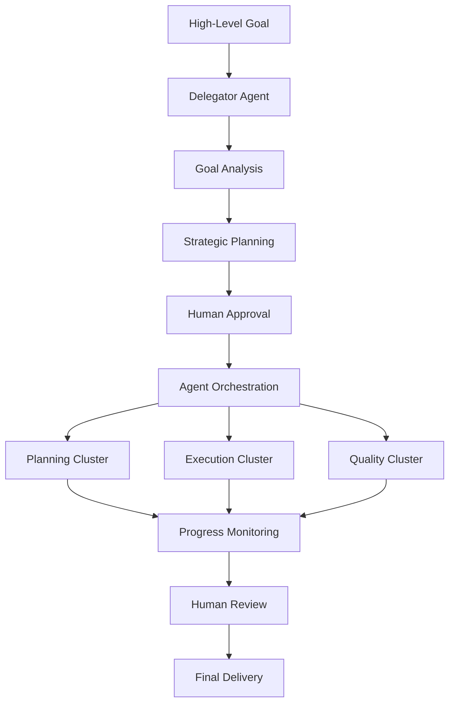

# Delegator Agent Guide: Orchestrating the AI Dev Playbook Agent Swarm

This guide provides comprehensive instructions for using the **Delegator Agent** - the meta-agent that orchestrates the specialized agent swarm to deliver autonomous, goal-oriented development while maintaining human strategic control and comprehensive governance.

## Overview

The Delegator Agent represents the ultimate evolution of the AI Dev Playbook, transforming it from a linear agent chain into a sophisticated agent swarm capable of handling complex, multi-phase projects autonomously while maintaining the highest standards of quality, security, and governance.

### Key Capabilities

- **Goal Analysis**: Parse complex, ambiguous objectives into clear requirements
- **Strategic Planning**: Design comprehensive implementation strategies with risk management
- **Agent Orchestration**: Coordinate nine specialized agents for optimal task execution
- **Human Coordination**: Maintain strategic oversight with approval checkpoints
- **Quality Assurance**: Ensure all outputs meet governance and security standards
- **Knowledge Capture**: Generate comprehensive documentation and audit trails

## Architecture Overview

### Agent Swarm Structure

The Delegator Agent coordinates three specialized clusters:

#### **Planning Cluster**
- **Specification Agent (00)**: Requirements analysis and documentation
- **Planner Agent (01)**: Technical implementation planning  
- **Estimator Agent (02)**: Effort and complexity assessment

#### **Execution Cluster**
- **Coder Agent (03)**: Implementation and development
- **Refactorer Agent (05)**: Code quality and optimization
- **Tester Agent (04)**: Quality assurance and validation

#### **Quality Cluster**
- **Security Reviewer Agent (07)**: Security analysis and hardening
- **Documenter Agent (06)**: Documentation generation and maintenance
- **AIDEV Archiver Agent (08)**: Knowledge capture and audit trails

### Orchestration Flow



## Getting Started

### Prerequisites

1. **Complete AI Dev Playbook Setup**: All specialized agents must be available
2. **Secure Environment**: Sandbox execution capabilities for code-running agents
3. **Project Context**: Clear understanding of current system and requirements
4. **Human Oversight**: Designated human stakeholder for strategic decisions

### Basic Usage

#### Step 1: Initialize Orchestration Session

```bash
# Start orchestration with a high-level goal
./ai-dev/scripts/delegator-orchestrator.sh start "Implement OAuth 2.0 authentication system"
```

This command:
- Initializes the orchestration environment
- Validates all specialized agents are available
- Creates project context and coordination templates
- Prepares the environment for Delegator Agent interaction

#### Step 2: Load Delegator Agent

Use your AI development environment to load the Delegator Agent:
- **Prompt Location**: `ai-dev/prompts/00-delegator-agent.md`
- **Context Files**: Generated project context and coordination templates
- **Goal**: Present the high-level objective for analysis

#### Step 3: Strategic Planning Phase

The Delegator Agent will:
1. **Analyze the Goal**: Break down the objective into clear requirements
2. **Assess Current State**: Understand existing architecture and constraints
3. **Design Strategy**: Create comprehensive implementation plan with phases
4. **Risk Assessment**: Identify potential issues and mitigation strategies
5. **Present Plan**: Generate detailed strategic plan for human review

#### Step 4: Strategic Validation (Critical Checkpoint)

**Human responsibilities:**
- Review the strategic plan for technical feasibility
- Validate alignment with business objectives
- Assess risk mitigation strategies
- Approve timeline and resource estimates
- Provide explicit approval before execution begins

#### Step 5: Orchestrated Execution

Upon approval, the Delegator Agent will:
- **Coordinate Agent Swarm**: Assign tasks to specialized agents
- **Monitor Progress**: Track completion and identify issues
- **Manage Dependencies**: Coordinate handoffs between agents
- **Report Status**: Provide regular updates to human stakeholders
- **Ensure Quality**: Validate outputs against governance standards

#### Step 6: Final Review and Delivery

The Delegator Agent concludes by:
- **Quality Assurance**: Comprehensive testing and security review
- **Documentation**: Complete technical and process documentation
- **Knowledge Capture**: Generate AIDEV.md entries and lessons learned
- **Handoff**: Present final deliverables for human acceptance

## Advanced Usage Patterns

### Complex Project Management

For large, multi-component projects:

```bash
# Example: System migration project
./ai-dev/scripts/delegator-orchestrator.sh start "Migrate monolithic application to microservices architecture with zero downtime"
```

**Strategic Planning Considerations:**
- **Phased Approach**: Break migration into logical phases
- **Risk Management**: Comprehensive rollback and contingency plans
- **Stakeholder Coordination**: Multiple teams and systems affected
- **Performance Validation**: Continuous monitoring and optimization

### Integration Projects

For projects involving external systems:

```bash
# Example: Third-party integration
./ai-dev/scripts/delegator-orchestrator.sh start "Integrate with Salesforce CRM and implement bidirectional data synchronization"
```

**Key Focus Areas:**
- **API Analysis**: Understanding external system capabilities
- **Data Mapping**: Comprehensive field and entity mapping
- **Error Handling**: Robust handling of integration failures
- **Security**: Authentication, authorization, and data protection

### Performance Optimization

For system-wide performance improvements:

```bash
# Example: Performance optimization
./ai-dev/scripts/delegator-orchestrator.sh start "Optimize application performance to handle 10x current load with sub-200ms response times"
```

**Optimization Strategy:**
- **Baseline Measurement**: Current performance metrics
- **Bottleneck Analysis**: Identify performance constraints
- **Optimization Plan**: Database, caching, and code improvements
- **Validation**: Load testing and performance benchmarking

## Human Interaction Protocols

### Communication Framework

#### Regular Status Updates
- **Frequency**: At minimum, at each phase completion
- **Format**: Executive summary with key metrics and decisions
- **Content**: Progress, risks, decisions, and next steps
- **Escalation**: Immediate notification of critical issues

#### Decision Points
- **Strategic Decisions**: Always require human approval
- **Technical Decisions**: Within approved constraints, autonomous
- **Risk Decisions**: Escalate if impact exceeds defined thresholds
- **Scope Changes**: Always require human review and approval

#### Intervention Capabilities
- **Pause Command**: Immediately halt all agent activities
- **Course Correction**: Accept new guidance and adjust plans
- **Direct Override**: Allow human to take control of specific tasks
- **Plan Modification**: Incorporate changes and continue execution

### Approval Workflows

#### Strategic Plan Approval
**Required Elements:**
- [ ] Executive summary and key decisions
- [ ] Detailed implementation phases with timelines
- [ ] Risk assessment and mitigation strategies
- [ ] Resource requirements and dependencies
- [ ] Success criteria and validation methods
- [ ] Quality gates and security measures

#### Phase Completion Sign-off
**Validation Checklist:**
- [ ] All phase objectives completed
- [ ] Quality standards met
- [ ] Security requirements satisfied
- [ ] Documentation updated
- [ ] Next phase ready to begin

#### Final Deliverable Acceptance
**Acceptance Criteria:**
- [ ] All success criteria met
- [ ] Comprehensive testing completed
- [ ] Security audit passed
- [ ] Documentation complete
- [ ] Knowledge transfer completed

## Quality Assurance Framework

### Security Requirements

#### Mandatory Security Measures
- **Sandbox Execution**: All code execution in secure, isolated environments
- **Security Reviews**: Comprehensive analysis at each major milestone
- **Vulnerability Assessment**: Automated and manual security testing
- **Compliance Validation**: Adherence to organizational security policies

#### Security Checkpoints
1. **Planning Phase**: Security requirements analysis
2. **Implementation Phase**: Secure coding practices validation
3. **Testing Phase**: Security testing and vulnerability scanning
4. **Deployment Phase**: Security configuration and monitoring setup

### Quality Standards

#### Code Quality Metrics
- **Test Coverage**: Minimum 80% for critical paths
- **Code Complexity**: Cyclomatic complexity within acceptable limits
- **Documentation**: Comprehensive inline and external documentation
- **Performance**: Response times within specified requirements

#### Process Quality Indicators
- **Traceability**: Clear links from requirements to implementation
- **Audit Trail**: Comprehensive documentation of all decisions
- **Change Management**: Proper handling of scope and requirement changes
- **Risk Management**: Proactive identification and mitigation of risks

## Troubleshooting

### Common Issues and Solutions

#### **Issue**: Delegator Agent generates overly complex plans
**Solution**: 
- Provide more specific constraints and success criteria
- Break down the goal into smaller, more manageable objectives
- Review and refine the initial goal statement for clarity

#### **Issue**: Agent coordination failures or conflicts
**Solution**:
- Check agent availability and prompt compatibility
- Verify task dependencies and execution order
- Review resource allocation and potential conflicts

#### **Issue**: Human approval bottlenecks
**Solution**:
- Establish clear approval criteria and timelines
- Implement delegated authority for routine decisions
- Create escalation procedures for urgent issues

#### **Issue**: Quality gate failures
**Solution**:
- Review quality standards and acceptance criteria
- Implement incremental quality validation
- Provide additional context and guidance to agents

### Performance Optimization

#### Orchestration Efficiency
- **Parallel Execution**: Identify tasks that can run concurrently
- **Resource Optimization**: Balance agent workload and system resources
- **Dependency Management**: Minimize blocking dependencies between tasks
- **Progress Monitoring**: Implement early warning systems for delays

#### Communication Optimization
- **Status Reporting**: Automate routine status updates
- **Exception Handling**: Focus human attention on critical decisions
- **Context Management**: Maintain comprehensive project context
- **Knowledge Sharing**: Capture and reuse successful patterns

## Best Practices

### Goal Definition
- **Specific**: Clear, unambiguous objectives
- **Measurable**: Quantifiable success criteria
- **Achievable**: Realistic scope and timeline
- **Relevant**: Aligned with business objectives
- **Time-bound**: Clear deadlines and milestones

### Strategic Planning
- **Comprehensive Analysis**: Thorough understanding of current state
- **Risk-Aware**: Proactive identification and mitigation of risks
- **Phased Approach**: Logical breakdown into manageable phases
- **Quality-Focused**: Built-in testing and validation at each step
- **Stakeholder-Inclusive**: Consideration of all affected parties

### Execution Management
- **Continuous Monitoring**: Real-time visibility into progress and issues
- **Adaptive Planning**: Ability to adjust strategy based on new information
- **Quality Gates**: Multiple validation checkpoints throughout process
- **Documentation**: Comprehensive capture of decisions and rationale
- **Communication**: Regular updates and stakeholder engagement

## Success Metrics

### Quantitative Metrics
- **Delivery Time**: Actual vs. planned timeline
- **Quality Metrics**: Defect rates, test coverage, performance
- **Scope Management**: Requirements delivered vs. planned
- **Resource Efficiency**: Effort spent vs. estimated

### Qualitative Metrics
- **Stakeholder Satisfaction**: Feedback from users and business stakeholders
- **Code Quality**: Maintainability, readability, and architectural soundness
- **Team Learning**: Knowledge gained and process improvements identified
- **Risk Management**: Effectiveness of risk identification and mitigation

## Future Enhancements

The Delegator Agent provides the foundation for:
- **Cross-Project Learning**: Knowledge sharing between projects
- **Predictive Analytics**: Improved estimation and risk prediction
- **Automated Optimization**: Self-improving orchestration patterns
- **Enterprise Integration**: Connection with organizational tools and processes

This Delegator Agent guide provides the framework for successfully managing complex, autonomous development projects while maintaining the human oversight, security, and quality standards that make the AI Dev Playbook suitable for enterprise environments.
