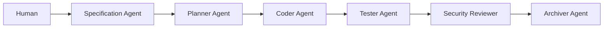
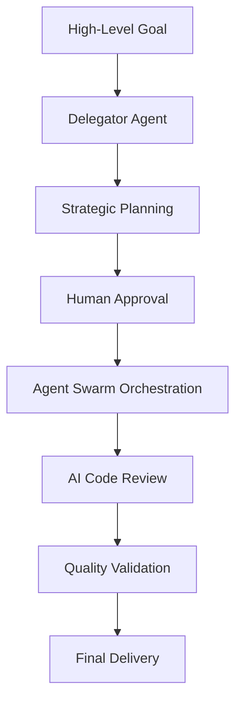

# AI Dev Playbook Migration Guide: v1.0 → v2.0

This comprehensive guide helps existing AI Dev Playbook v1.0 users migrate to the revolutionary v2.0 with its **Agent Swarm Architecture**, **Delegator Agent Orchestration**, and **AI-Powered Code Review** capabilities.

## Table of Contents

1. [Migration Overview](#migration-overview)
2. [What's New in v2.0](#whats-new-in-v20)
3. [New Files and Components](#new-files-and-components)
4. [Step-by-Step Migration Process](#step-by-step-migration-process)
5. [Updated Workflows](#updated-workflows)
6. [End-to-End Example](#end-to-end-example)
7. [Advanced Features](#advanced-features)
8. [Troubleshooting](#troubleshooting)
9. [Best Practices](#best-practices)

## Migration Overview

### What Changed?

**AI Dev Playbook v1.0** was a linear agent chain with 9 specialized agents requiring manual orchestration.

**AI Dev Playbook v2.0** is a sophisticated agent swarm with 10 specialized agents orchestrated by a meta-agent, featuring autonomous goal-oriented development and intelligent code review.

### Migration Impact

- **✅ Backward Compatible**: All v1.0 workflows continue to work
- **🚀 Enhanced Capabilities**: New autonomous orchestration and code review features
- **📁 New Files**: Additional agents, automation scripts, and documentation
- **⚡ Improved Efficiency**: Reduced manual coordination overhead

### Migration Timeline

- **Immediate**: Start using new features alongside existing workflows
- **Gradual**: Adopt advanced capabilities as team becomes comfortable
- **Complete**: Full migration to agent swarm architecture when ready

## What's New in v2.0

### 🤖 **Agent Swarm Architecture**

**v1.0**: Linear agent chain with manual orchestration
```
Human → Spec → Plan → Code → Test → Review → Archive
```

**v2.0**: Orchestrated agent swarm with meta-coordination
```
                    Delegator Agent
                   (Meta-Orchestrator)
                           ↓
Planning Cluster:     Execution Cluster:     Quality Cluster:
├─ Specification     ├─ Coder               ├─ Security Reviewer
├─ Planner           ├─ Refactorer          ├─ Documenter  
└─ Estimator         └─ Tester              ├─ AIDEV Archiver
                                            └─ AI Code Review
```

### 🎯 **Autonomous Goal-Oriented Development**

**New Capability**: Present high-level goals to the Delegator Agent for autonomous decomposition and execution with human strategic oversight.

### 🔍 **AI-Powered Code Review**

**New Capability**: Comprehensive, intelligent code analysis covering quality, security, performance, and maintainability with Git workflow integration.

### 🔒 **Enterprise-Grade Security & Governance**

**Enhanced**: Mandatory secure sandbox execution, comprehensive audit trails, and structured human oversight patterns.

## New Files and Components

### **New Agent Prompts**

#### **1. Delegator Agent (`ai-dev/prompts/00-delegator-agent.md`)**
**Purpose**: Meta-agent that orchestrates the specialized agent swarm for autonomous goal-oriented development.

**Key Capabilities**:
- **Goal Analysis**: Parse complex objectives into actionable requirements
- **Strategic Planning**: Design comprehensive implementation strategies
- **Agent Orchestration**: Coordinate specialized agents across three clusters
- **Human Coordination**: Maintain strategic oversight with approval checkpoints
- **Risk Management**: Proactive identification and mitigation of project risks

**When to Use**: For complex, multi-phase projects that require strategic planning and coordinated execution.

#### **2. AI Code Review Agent (`ai-dev/prompts/09-code-review-agent.md`)**
**Purpose**: Intelligent code analysis agent providing comprehensive, multi-dimensional code reviews.

**Key Capabilities**:
- **Quality Assessment**: Code quality, maintainability, and best practices validation
- **Security Analysis**: Vulnerability detection and compliance validation
- **Performance Review**: Algorithmic complexity and optimization opportunities
- **Documentation Review**: Code comments and documentation completeness
- **Testing Analysis**: Test coverage and quality assessment

**When to Use**: For pre-commit reviews, pull request analysis, and comprehensive code quality assurance.

### **New Automation Scripts**

#### **3. Delegator Orchestrator (`ai-dev/scripts/delegator-orchestrator.sh`)**
**Purpose**: Infrastructure script for initializing and managing agent swarm orchestration sessions.

**Key Functions**:
- **Environment Setup**: Initialize orchestration environment and validate agents
- **Project Context**: Generate comprehensive project context for the Delegator Agent
- **Session Management**: Start, monitor, and cleanup orchestration sessions
- **Template Generation**: Create coordination templates and workflow structures

**Usage Examples**:
```bash
# Start orchestration session
./ai-dev/scripts/delegator-orchestrator.sh start "Implement OAuth 2.0 authentication system"

# Check orchestration status
./ai-dev/scripts/delegator-orchestrator.sh status

# Clean up orchestration environment
./ai-dev/scripts/delegator-orchestrator.sh cleanup
```

#### **4. Code Review Automation (`ai-dev/scripts/code-review-automation.sh`)**
**Purpose**: Automation script for Git-integrated intelligent code review workflows.

**Key Functions**:
- **Change Analysis**: Analyze commits, staged changes, and pull requests
- **Context Generation**: Create structured review context for the AI Code Review Agent
- **Git Integration**: Seamless integration with Git workflows and CI/CD pipelines
- **AIDEV.md Integration**: Automated generation of review entries for development log

**Usage Examples**:
```bash
# Review staged changes before commit
./ai-dev/scripts/code-review-automation.sh review staged pre-commit

# Review specific commit
./ai-dev/scripts/code-review-automation.sh review abc1234 commit

# Review pull request
./ai-dev/scripts/code-review-automation.sh review main..feature-branch pull-request

# Setup Git hooks for automated reviews
./ai-dev/scripts/code-review-automation.sh setup-hooks
```

### **New Documentation**

#### **5. Delegator Agent Guide (`docs/delegator-agent-guide.md`)**
**Purpose**: Comprehensive usage guide for the Delegator Agent and agent swarm orchestration.

**Contents**:
- Architecture overview and orchestration flow
- Step-by-step usage instructions
- Advanced usage patterns for complex projects
- Human interaction protocols and approval workflows
- Quality assurance framework and troubleshooting

#### **6. AI Code Review Guide (`docs/ai-code-review-guide.md`)**
**Purpose**: Complete implementation guide for AI-powered code review processes.

**Contents**:
- Review process flow and analysis dimensions
- Usage patterns for different review scenarios
- Integration with development workflows and CI/CD
- Best practices and quality assurance guidelines
- Advanced configurations and troubleshooting

### **Enhanced Documentation**

#### **7. Updated Workflow Guides**
- **Aider-Style Workflow Guide**: Git-centric workflow with automated commit analysis
- **Sandboxed Testing Guide**: Secure test execution environments
- **Macro-Workflow Guide**: Devin-style autonomous development processes

## Step-by-Step Migration Process

### **Phase 1: Preparation (5 minutes)**

#### **1. Backup Current Setup**
```bash
# Create backup of current AI Dev Playbook setup
cp -r .ai-dev .ai-dev-v1-backup
cp AIDEV.md AIDEV-v1-backup.md
```

#### **2. Update Repository**
```bash
# Pull latest v2.0 changes
git pull origin main

# Or download new files if using as template
# Download and copy new files to your repository
```

#### **3. Verify New Files**
```bash
# Check new agent prompts
ls -la ai-dev/prompts/00-delegator-agent.md
ls -la ai-dev/prompts/09-code-review-agent.md

# Check new automation scripts
ls -la ai-dev/scripts/delegator-orchestrator.sh
ls -la ai-dev/scripts/code-review-automation.sh

# Check new documentation
ls -la docs/delegator-agent-guide.md
ls -la docs/ai-code-review-guide.md
```

### **Phase 2: Basic Integration (10 minutes)**

#### **1. Test Automation Scripts**
```bash
# Make scripts executable
chmod +x ai-dev/scripts/delegator-orchestrator.sh
chmod +x ai-dev/scripts/code-review-automation.sh

# Test orchestration script
./ai-dev/scripts/delegator-orchestrator.sh help
./ai-dev/scripts/delegator-orchestrator.sh status

# Test code review script
./ai-dev/scripts/code-review-automation.sh help
./ai-dev/scripts/code-review-automation.sh status
```

#### **2. Review New Agent Prompts**
```bash
# Examine the Delegator Agent prompt
cat ai-dev/prompts/00-delegator-agent.md | head -50

# Examine the AI Code Review Agent prompt
cat ai-dev/prompts/09-code-review-agent.md | head -50
```

#### **3. Update Team Documentation**
- Review updated README.md for new capabilities
- Share migration guide with team members
- Update internal documentation to reference new features

### **Phase 3: Gradual Adoption (Ongoing)**

#### **1. Start with Code Review**
Begin using AI-powered code review for immediate value:

```bash
# Review your latest commit
./ai-dev/scripts/code-review-automation.sh review HEAD commit

# Setup automated Git hooks
./ai-dev/scripts/code-review-automation.sh setup-hooks
```

#### **2. Experiment with Orchestration**
Try the Delegator Agent for small projects:

```bash
# Start with a simple goal
./ai-dev/scripts/delegator-orchestrator.sh start "Add input validation to user registration form"
```

#### **3. Integrate into Workflows**
- Add code review automation to CI/CD pipelines
- Use Delegator Agent for complex feature development
- Leverage automation scripts for routine tasks

## Updated Workflows

### **Traditional Workflow (v1.0) - Still Supported**



**Usage**: Continue using individual agents for discrete, well-defined tasks.

### **Enhanced Workflow (v2.0) - Recommended**



**Usage**: Use for complex, multi-phase projects requiring strategic coordination.

### **Hybrid Workflow (v2.0) - Flexible**

Combine traditional and enhanced approaches:
- Use **individual agents** for quick, focused tasks
- Use **Delegator Agent** for complex project coordination
- Use **AI Code Review** for all code changes
- Use **automation scripts** to reduce manual overhead

## End-to-End Example

Let's walk through a complete example: **"Implement a user authentication system with OAuth 2.0 integration"**

### **v1.0 Approach (Manual Orchestration)**

```bash
# Step 1: Create specifications
# Manually invoke Specification Agent with requirements

# Step 2: Create implementation plan
# Manually invoke Planner Agent with specifications

# Step 3: Implement code
# Manually invoke Coder Agent with plan

# Step 4: Create tests
# Manually invoke Tester Agent with implementation

# Step 5: Security review
# Manually invoke Security Reviewer Agent

# Step 6: Document and archive
# Manually invoke Documenter and Archiver agents
```

**Time Investment**: 2-3 hours of manual coordination
**Human Overhead**: High - constant context switching and agent management

### **v2.0 Approach (Orchestrated Agent Swarm)**

#### **Step 1: Initialize Orchestration**
```bash
./ai-dev/scripts/delegator-orchestrator.sh start "Implement user authentication system with OAuth 2.0 integration, including Google and GitHub providers, secure session management, and comprehensive testing"
```

**Output**:
```
🤖 DELEGATOR AGENT ORCHESTRATION READY
=====================================

## Next Steps:
1. Load Delegator Agent: Use the prompt at ai-dev/prompts/00-delegator-agent.md
2. Provide Context: Share the project context file
3. Set Goal: Present the high-level goal for analysis and planning
4. Review Plan: The Delegator will generate a comprehensive strategic plan
5. Approve Execution: Once approved, the Delegator will orchestrate the agent swarm

Ready to begin autonomous goal-oriented development!
```

#### **Step 2: Load Delegator Agent and Execute**

**In your AI development environment:**

1. **Load the Delegator Agent** using `ai-dev/prompts/00-delegator-agent.md`
2. **Provide the generated project context** from the orchestration script
3. **Present the goal** for analysis and strategic planning

**Delegator Agent Response** (Example):
```markdown
# Strategic Plan: OAuth 2.0 Authentication System

## Goal Analysis
Implement comprehensive user authentication system with OAuth 2.0 integration
supporting Google and GitHub providers, secure session management, and testing.

## Strategic Architecture
- **Authentication Service**: Core OAuth 2.0 implementation
- **Provider Integration**: Google and GitHub OAuth flows
- **Session Management**: Secure token handling and refresh
- **Security Layer**: CSRF protection, secure cookies, rate limiting
- **Testing Suite**: Unit, integration, and security tests

## Phase Execution Plan

### Phase 1: Foundation (Planning Cluster)
**Specification Agent**: Create detailed OAuth 2.0 requirements and API contracts
**Planner Agent**: Design technical architecture and implementation strategy
**Estimator Agent**: Assess complexity and timeline for each component

### Phase 2: Core Implementation (Execution Cluster)
**Coder Agent**: Implement OAuth 2.0 service and provider integrations
**Refactorer Agent**: Optimize code structure and performance
**Tester Agent**: Create comprehensive test suite

### Phase 3: Quality Assurance (Quality Cluster)
**Security Reviewer Agent**: Comprehensive security analysis and hardening
**AI Code Review Agent**: Multi-dimensional code quality assessment
**Documenter Agent**: API documentation and integration guides
**AIDEV Archiver Agent**: Knowledge capture and audit trail generation

## Human Approval Required
Please review and approve this strategic plan before execution begins.
```

#### **Step 3: Approve and Execute**

**Human Response**: "Approved. Please proceed with execution."

**Delegator Agent**: Orchestrates the agent swarm through all phases, providing regular updates and handling coordination automatically.

#### **Step 4: Continuous Code Review**

Throughout development, use AI-powered code review:

```bash
# Review each commit as it's made
./ai-dev/scripts/code-review-automation.sh review HEAD commit

# Review the entire feature branch before merging
./ai-dev/scripts/code-review-automation.sh review main..oauth-implementation pull-request
```

#### **Step 5: Final Delivery**

**Delegator Agent** provides comprehensive project completion report including:
- All deliverables completed and validated
- Security review passed with recommendations implemented
- Comprehensive testing completed with coverage metrics
- Documentation generated and integrated
- AIDEV.md updated with complete project narrative

**Time Investment**: 30 minutes of human strategic oversight
**Human Overhead**: Low - focus on strategic decisions, not tactical coordination

### **Comparison: v1.0 vs v2.0**

| Aspect | v1.0 (Manual) | v2.0 (Orchestrated) |
|--------|---------------|---------------------|
| **Human Time** | 2-3 hours | 30 minutes |
| **Coordination** | Manual agent management | Automated orchestration |
| **Strategic Focus** | Tactical execution | Strategic oversight |
| **Quality Assurance** | Manual review process | AI-powered comprehensive analysis |
| **Documentation** | Manual AIDEV.md updates | Automated knowledge capture |
| **Risk Management** | Ad-hoc identification | Proactive risk assessment |
| **Scalability** | Limited by human capacity | Scales with project complexity |

## Advanced Features

### **Multi-Project Orchestration**

Use the Delegator Agent for coordinating multiple related projects:

```bash
# Complex system migration
./ai-dev/scripts/delegator-orchestrator.sh start "Migrate monolithic application to microservices architecture with zero downtime, including database migration, API gateway setup, and monitoring implementation"
```

### **Continuous Code Review Integration**

Integrate AI-powered code review with CI/CD pipelines:

```yaml
# GitHub Actions example
name: AI Code Review
on: [pull_request]
jobs:
  ai-review:
    runs-on: ubuntu-latest
    steps:
      - uses: actions/checkout@v2
      - name: Run AI Code Review
        run: |
          ./ai-dev/scripts/code-review-automation.sh review ${{ github.event.pull_request.base.sha }}..${{ github.event.pull_request.head.sha }} pull-request
```

### **Custom Agent Configurations**

Customize agents for specific project needs:

```bash
# Security-focused review
./ai-dev/scripts/code-review-automation.sh review staged security-review

# Performance-focused review
./ai-dev/scripts/code-review-automation.sh review HEAD~3..HEAD performance-review
```

### **Quality Gates and Metrics**

Implement automated quality gates based on AI review results:

```bash
# Example quality gate script
#!/bin/bash
REVIEW_OUTPUT="$1"
QUALITY_THRESHOLD=8
SECURITY_THRESHOLD=9

# Parse AI review scores and enforce thresholds
# Fail build if quality standards not met
```

## Troubleshooting

### **Common Migration Issues**

#### **Issue**: Scripts not executable
**Solution**:
```bash
chmod +x ai-dev/scripts/*.sh
```

#### **Issue**: Orchestration environment initialization fails
**Solution**:
```bash
# Check Git repository status
git status

# Ensure .ai-dev directory structure exists
mkdir -p .ai-dev/temp .ai-dev/memory
```

#### **Issue**: AI agents generate overly complex plans
**Solution**:
- Provide more specific constraints in goal description
- Break large goals into smaller, focused objectives
- Use traditional workflow for simple tasks

#### **Issue**: Code review generates too many false positives
**Solution**:
- Provide more context about business logic and requirements
- Customize review focus areas for specific change types
- Calibrate quality thresholds for your project standards

### **Performance Optimization**

#### **Reduce Orchestration Overhead**
- Use specific, well-defined goals
- Provide clear constraints and success criteria
- Leverage project context and existing documentation

#### **Improve Code Review Accuracy**
- Include business logic explanations in commit messages
- Provide architectural context and coding standards
- Use structured commit message format for better analysis

## Best Practices

### **Migration Strategy**

#### **1. Gradual Adoption**
- Start with AI-powered code review for immediate value
- Experiment with Delegator Agent on small projects
- Gradually increase usage as team becomes comfortable

#### **2. Team Training**
- Share migration guide and new documentation with team
- Conduct training sessions on new capabilities
- Create internal examples and success stories

#### **3. Process Integration**
- Update development workflows to include new capabilities
- Integrate automation scripts with existing tools
- Establish quality gates and metrics for continuous improvement

### **Effective Usage Patterns**

#### **Use Delegator Agent When:**
- Project involves multiple subsystems or components
- Requirements are high-level and need decomposition
- Coordination between multiple development phases is needed
- Strategic planning and risk management are important

#### **Use AI Code Review When:**
- Any code changes are made (universal application)
- Security or compliance requirements are critical
- Performance optimization is needed
- Code quality standards must be maintained

#### **Use Traditional Agents When:**
- Task is well-defined and focused
- Quick turnaround is needed
- Specific expertise is required
- Learning or experimenting with individual agent capabilities

### **Quality Assurance**

#### **Validation Checklist**
- [ ] All new files are present and executable
- [ ] Automation scripts function correctly
- [ ] Agent prompts are accessible and complete
- [ ] Documentation is comprehensive and accurate
- [ ] Team is trained on new capabilities
- [ ] Integration with existing workflows is seamless

#### **Success Metrics**
- **Reduced Manual Overhead**: Less time spent on coordination
- **Improved Code Quality**: Higher quality scores and fewer defects
- **Enhanced Security**: Better vulnerability detection and compliance
- **Faster Development**: Shorter time from goal to delivery
- **Better Documentation**: More comprehensive and accurate project records

## Conclusion

The migration from AI Dev Playbook v1.0 to v2.0 represents a fundamental evolution from manual agent coordination to autonomous agent swarm orchestration. The new capabilities provide:

🤖 **Autonomous Development**: Delegator Agent handles complex project coordination  
🔍 **Intelligent Quality**: AI-powered code review ensures comprehensive analysis  
🔒 **Enterprise Security**: Sandbox execution and governance compliance  
📊 **Measurable Results**: Quality metrics and automated validation  

**Migration Benefits:**
- **Reduced Human Overhead**: Focus on strategy, not tactics
- **Improved Quality**: Comprehensive, consistent analysis
- **Enhanced Security**: Proactive vulnerability detection
- **Better Documentation**: Automated knowledge capture
- **Scalable Processes**: Handles increasing project complexity

**Next Steps:**
1. Complete the migration process using this guide
2. Start with code review automation for immediate value
3. Experiment with Delegator Agent orchestration
4. Gradually adopt advanced features as team expertise grows
5. Share feedback and success stories with the community

Welcome to the future of AI-assisted development with AI Dev Playbook v2.0! 🚀
